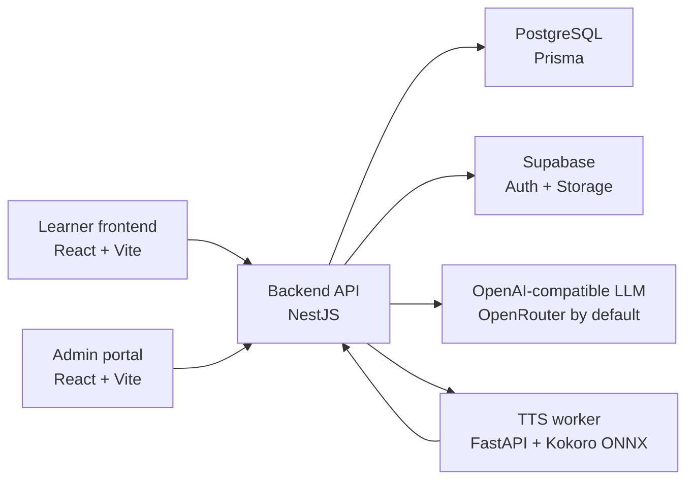

# Project Overview

Last code audit: 2026-07-06.

PhiloMind is a learning platform for philosophy courses. The current repository is a four-service monorepo: learner frontend, admin frontend, NestJS backend, and FastAPI TTS worker. PostgreSQL is the system of record through Prisma; Supabase is used for Auth integration and Storage when configured.

## Architecture

## Repository Layout

| Path | Purpose |
|---|---|
| `backend/` | NestJS REST API, Prisma schema, seed scripts, AI/TTS/storage integrations. |
| `frontend/` | Student-facing React app with journey mindmap, lesson player, quizzes, debate, flashcards, and settings. |
| `admin/` | Admin React app for content and user management. |
| `tts_worker/` | FastAPI speech worker that returns WAV audio. |
| `docs/` | Current documentation only; stale proposal/report files have been removed. |
| `scripts/` | Health/integration utilities. |
| `.github/workflows/` | CI plus Hugging Face deployment workflows for backend and TTS worker. |

## Backend

Entry points:

- `backend/src/main.ts` sets `/api` as the global prefix, configures Helmet, CORS, validation, Swagger, static `/public/` uploads, and the runtime port.
- `backend/src/app.module.ts` wires modules for auth, users, courses, quizzes, flashcards, debates, Philosofun, Supabase, AI, TTS, and Prisma.
- `backend/prisma/schema.prisma` defines the database model.

Main modules:

| Module | Responsibility |
|---|---|
| `auth/` | JWT strategy, auth guard, role guard, role decorator. |
| `users/` | Local login/register, Google ID token login, Supabase JWT login, user CRUD, feedback. |
| `courses/` | Courses, chapters, concept nodes, journey, lesson flow, progress, comments, documents, podcast CRUD, file uploads. |
| `flashcards/` | Due card retrieval, SM-2 style review updates, admin CRUD and bulk import. |
| `quizzes/` | Quiz CRUD and node filtering. |
| `debate/` | Topic and concept-node Socratic debate sessions through the AI service. |
| `philosofun/` | Video CRUD for the entertainment section. |
| `ai/` | OpenAI-compatible client with fallback content when no API key is configured. |
| `tts/` | Backend proxy to the TTS worker and Supabase/local upload. |
| `supabase/` | Supabase client and storage helper with local mock fallback. |
| `database/` | Prisma client wrapper with pooler-safe URL normalization and query concurrency guard. |

## Database Model

`ConceptNode` is the central learning unit. It belongs to a `Chapter` and connects to flashcards, podcast, debate sessions, progress, warmups, comments, quizzes, and the component-based lesson fields:

- `lessonFlow`: ordered JSON array of lesson components.
- `lessonMedia`: optional center-column media array.
- `lessonType`: currently forced to `flow` by node create/update.
- `contentReady`: whether the lesson should be available to learners.
- `lessonStatus`: `draft`, `published`, or `archived`.

Other core models:

| Model | Notes |
|---|---|
| `User` | Student/admin identity, role, streak, progress, feedback, comments, owned courses. |
| `Course` | Container for chapters and documents. |
| `Chapter` | Ordered hierarchy with optional parent chapter. |
| `Progress` | Per-user per-node status and component progress state. |
| `Flashcard` / `FlashcardReview` | Flashcard content and review schedule. |
| `Podcast` | Audio URL plus transcript JSON, one per concept node. |
| `DebateTopic` / `Debate` | Reusable topics and user debate transcripts. |
| `Warmup` | Short pre-lesson activity data. |
| `Quiz` | Standalone quiz/game content. |
| `Comment` | Node discussion comments. |
| `Document` | PDF/document references. |
| `Philosofun` | Video item metadata. |

## Learner Frontend

Current routes from `frontend/src/App.js`:

| Route | Screen |
|---|---|
| `/` | Home dashboard. |
| `/practice` | Practice hub. |
| `/practice/shinkei/:id` | Flashcard memory game. |
| `/debate` | Socratic debate corner. |
| `/lessons` | Journey mindmap and lesson player. |
| `/philosofun` | Philosofun videos. |
| `/docs` | In-app reference screen. |
| `/settings` | User settings. |
| `/login`, `/register` | Auth screens. |
| `/quiz/matching/:id`, `/quiz/analysis/:id`, `/quiz/essay/:id`, `/quiz/mcq/:id`, `/image-quiz/:id` | Legacy/specialized quiz routes. |

Important frontend data pieces:

- `frontend/src/services/api.js` is the fetch wrapper and attaches the local JWT.
- `frontend/src/services/queryKeys.js` centralizes React Query keys.
- `frontend/src/hooks/useJourney.js` resolves the main course and journey.
- `frontend/src/hooks/useNodeDetails.js` loads lesson details.
- `frontend/src/hooks/useMutations.js` updates progress, component progress, comments, debate messages, and flashcard reviews.

## Admin Portal

Current routes from `admin/src/App.js`:

| Route | Screen |
|---|---|
| `/login` | Admin login. |
| `/` | Dashboard. |
| `/users` | User management. |
| `/courses` | Course management. |
| `/nodes` | Chapter/node authoring, lesson flow JSON, media uploads, warmups, flashcards, quizzes, podcasts, documents. |
| `/practice` | Practice content management. |
| `/debates` | Debate topics/sessions. |
| `/philosofun` | Philosofun videos. |

The admin portal currently authors `lessonFlow` directly as JSON in `Nodes.jsx`; backend validation is the contract that prevents unsupported component shapes from being stored.

## Major Runtime Flows

1. Authentication:
   - Local register/login returns a backend JWT.
   - Google and Supabase login routes map external identity into local `User` records.
   - Most backend modules use `JwtAuthGuard`; admin-only actions also use `RolesGuard` with `@Roles("admin")`.

2. Journey and lesson loading:
   - Learner app lists courses, picks the main philosophy course, loads `/api/courses/:id/journey`, then opens `/api/courses/nodes/:nodeId`.
   - Lesson access is blocked in the UI unless `contentReady === true` and `lessonStatus === "published"`.
   - The flow player renders `lessonFlow`, combines `lessonMedia` with legacy media components, and stores component progress through `/api/courses/nodes/:nodeId/component-progress`.

3. Completion and unlocking:
   - Completing the final lesson component calls `/api/courses/nodes/:nodeId/complete`.
   - Backend marks the node complete and unlocks the next node where applicable.
   - The learner app prefetches likely next node details to reduce transition latency.

4. AI and TTS:
   - Debate endpoints call `AIService` for Socratic replies.
   - Podcast synthesis calls backend `TTSService`, which posts to the FastAPI worker and uploads/stores the resulting audio URL.
   - AI/TTS code has fallback behavior for local demos without production keys.

5. Storage:
   - Supabase Storage is used when configured.
   - Local/mock storage URLs are returned when Supabase credentials are absent.

## Known Contract Notes

- The canonical Lesson contract is [LESSON_COMPONENTS.md](LESSON_COMPONENTS.md), not old proposal docs.
- Backend Swagger at `/docs` is the live DTO reference when enabled.
- The frontend and admin still use `REACT_APP_*` env names even though the runtime is Vite.
- `lessonMedia` is optional; current admin tools mostly append `media` components into `lessonFlow`, while the player also supports node-level `lessonMedia`.
