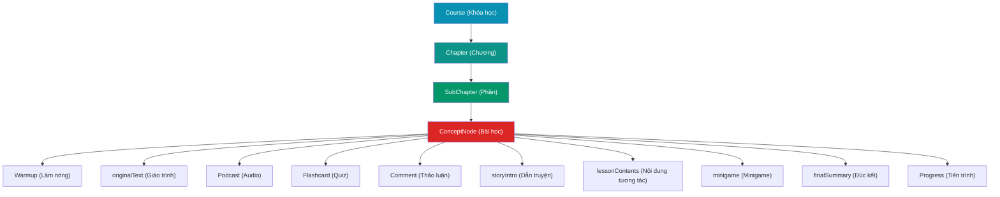
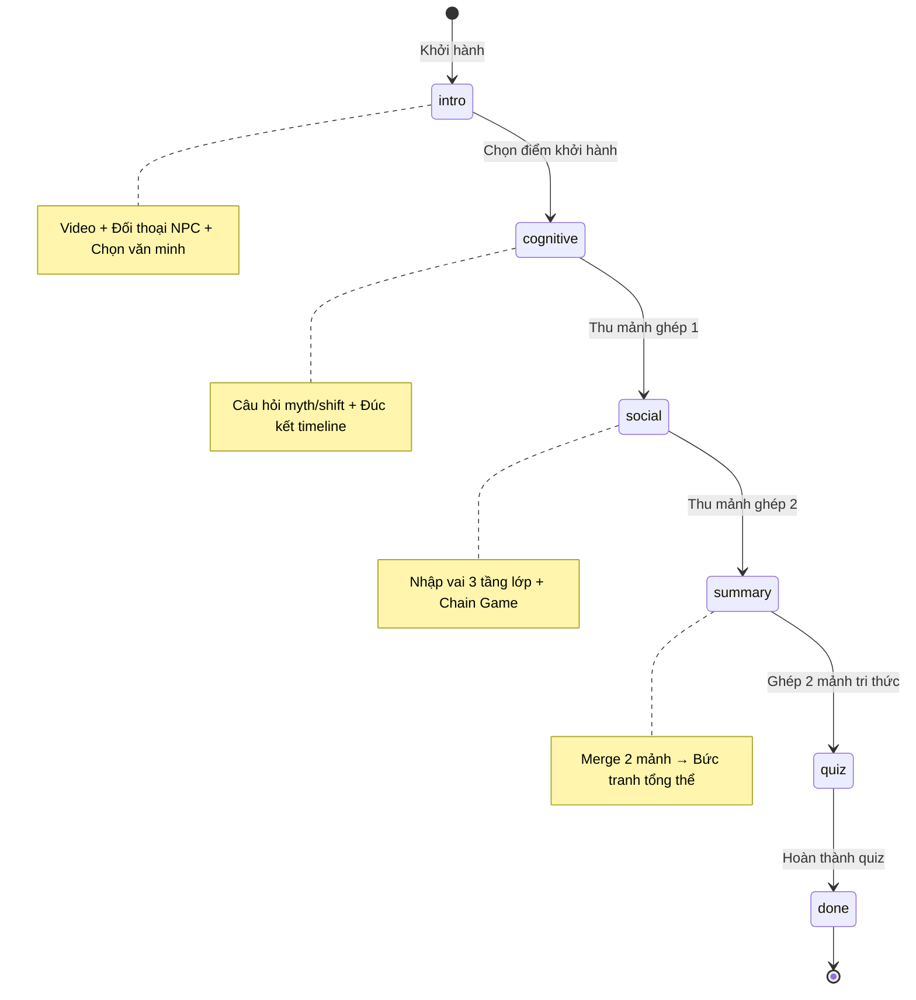
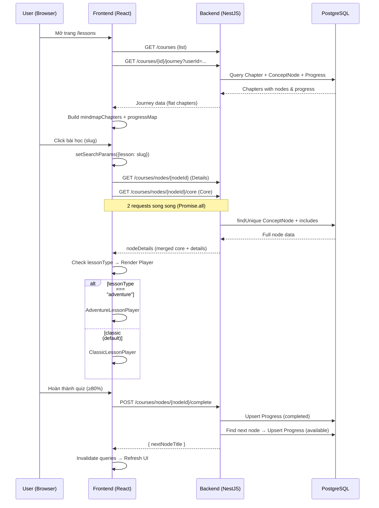

# 🔬 Phân Tích Chi Tiết: Hệ Thống Lesson — PhiloMind

## 1. Tổng Quan Kiến Trúc Lesson

Hệ thống Lesson là **trung tâm trải nghiệm học tập** của PhiloMind, được tổ chức theo mô hình **phân cấp 4 tầng** và hỗ trợ **2 chế độ học** khác nhau.



---

## 2. Cấu Trúc Dữ Liệu Database (Prisma Schema)

### 2.1 Cây Phân Cấp Chính

| Tầng | Model | Vai trò | Quan hệ |
|------|-------|---------|---------|
| 1 | `Course` | Khóa học gốc | `1:N` → Chapter |
| 2 | `Chapter` | Chương chính / Phần con | `self-ref` (parentChapterId) + `1:N` → ConceptNode |
| 3 | **`ConceptNode`** | **Bài học** _(trung tâm)_ | `1:N` → Flashcard, Warmup, Comment, Debate, Quiz, Progress; `1:1` → Podcast |

### 2.2 ConceptNode — Entity Trung Tâm

> [!IMPORTANT]
> `ConceptNode` là **trái tim** của toàn bộ hệ thống Lesson. Mọi dữ liệu học tập đều xoay quanh entity này.

```prisma
model ConceptNode {
  // === THÔNG TIN CƠ BẢN ===
  id            String   @id @default(uuid())
  title         String                          // Tên bài học
  summary       String                          // Tóm tắt AI
  originalText  String                          // Giáo trình Markdown đầy đủ
  quickTake     String                          // Quick take / Ý chính rút ra
  difficulty    String                          // "Easy" | "Medium" | "Hard"
  timeToRead    String                          // "12 min read"
  videoUrl      String?                         // YouTube URL bài giảng

  // === VỊ TRÍ TRONG CÂY ===
  orderIndex    Int                             // Thứ tự sắp xếp
  chapterId     String                          // Thuộc chapter nào

  // === DỮ LIỆU CHẾ ĐỘ ADVENTURE (JSON) ===
  lessonType     String?                        // "classic" | "adventure"
  storyIntro     Json?                          // Kịch bản dẫn truyện
  lessonContents Json?                          // Nội dung tương tác N vòng
  minigame       Json?                          // Cấu hình minigame
  finalSummary   Json?                          // Đúc kết + Quiz + Rewards

  // === QUAN HỆ ===
  flashcards    Flashcard[]
  podcast       Podcast?                        // 1:1 unique
  warmups       Warmup[]
  comments      Comment[]
  debates       Debate[]
  quizzes       Quiz[]
  progress      Progress[]
}
```

### 2.3 Các Entity Phụ Trợ

````carousel
**Warmup (Làm nóng)**
```prisma
model Warmup {
  type         String      // "image-guess" | "story" | "video" | "game"
  title        String
  image        String?     // URL hình ảnh hoặc YouTube
  blanks       String?     // Ô trống cho image-guess (vd: "T _ _ Ế T  H _ C")
  answer       String?     // Đáp án text
  story        String?     // Đoạn trích dẫn
  question     String?
  options      Json?       // Array<string>
  correctIndex Int?
  reveal       String      // Giải thích sau khi trả lời
}
```
<!-- slide -->
**Flashcard (Quiz cuối bài)**
```prisma
model Flashcard {
  tag       String       // Phân loại tag
  question  String       // Câu hỏi + đáp án (multi-line)
  answer    String       // Đáp án đúng
}
```
Format question: Dòng đầu là câu hỏi, các dòng sau là đáp án.
<!-- slide -->
**Podcast (Audio bài học)**
```prisma
model Podcast {
  nodeId     String @unique   // 1 node chỉ có 1 podcast
  audioUrl   String            // URL file audio
  transcript Json              // [{t: number, text: string}]
}
```
Transcript đồng bộ thời gian thực.
<!-- slide -->
**Progress (Tiến trình)**
```prisma
model Progress {
  status             String   // "locked" | "available" | "in_progress" | "completed"
  lessonCompleted    Boolean
  flashcardCompleted Boolean
  podcastCompleted   Boolean
  quizCompleted      Boolean

  @@unique([userId, nodeId])  // Mỗi user-node chỉ 1 record
}
```
````

---

## 3. Hai Chế Độ Học (Lesson Players)

> [!NOTE]
> Hệ thống dùng field `lessonType` trên `ConceptNode` để quyết định render player nào. Mặc định là `"classic"`.

### 3.1 Classic Lesson Player

**File:** [ClassicLessonPlayer.jsx](file:///d:/Workspace/Project/PhiloMind/frontend/src/pages/lesson/ClassicLessonPlayer.jsx)

Luồng tuyến tính, truyền thống:

```mermaid
flowchart LR
    A["🎬 Video YouTube"] -->|Xem xong| B["🔥 Warmup (Làm nóng)"]
    B -->|Hoàn thành| C["📖 Giáo trình Markdown"]
    C --> D["📝 Tóm tắt + Quick Take"]
    D --> E["🎧 Podcast Player"]
    E --> F["✅ Final Quiz (Flashcards)"]
    F --> G["💬 Discussion Forum"]

    style A fill:#dc2626,color:#fff
    style F fill:#16a34a,color:#fff
```



**Cơ chế Gate (Khóa):**
- **Gate 1**: Phải xem video trước (nút "Tôi đã xem xong video")
- **Gate 2**: Phải hoàn thành Warmup mới mở nội dung chính
- **Revisit**: Nếu đã hoàn thành → bỏ qua tất cả gate, hiện badge "Đã hoàn thành"

**Dữ liệu sử dụng từ `nodeDetails`:**

| Section | Field từ DB | Component |
|---------|------------|-----------|
| Video | `videoUrl` | `VideoWithReminder` |
| Warmup | `warmups[]` | `WarmupSection` |
| Giáo trình | `originalText` | `MarkdownRenderer` |
| Tóm tắt | `summary`, `quickTake` | Inline JSX |
| Podcast | `podcast` | `PodcastPlayer` |
| Quiz | `flashcards[]` | `FinalQuiz` |
| Thảo luận | `id` (nodeId) | `LessonDiscussion` |

---

### 3.2 Adventure Lesson Player

**File:** [AdventureLessonPlayer.jsx](file:///d:/Workspace/Project/PhiloMind/frontend/src/pages/lesson/AdventureLessonPlayer.jsx) _(1117 dòng)_

Luồng **nhập vai, game-hóa** với 6 giai đoạn:



**Stages & Dữ liệu JSON:**

| Stage | Tên | Dữ liệu JSON | Mô tả |
|-------|-----|---------------|-------|
| `intro` | Khởi hành | `storyIntro` | Video, hội thoại NPC (Sophia), chọn điểm khởi hành (Hy Lạp/Ấn Độ/Trung Hoa) |
| `cognitive` | Nhận thức | `lessonContents[0]` | Setup dialogue → Myth quiz → Twist dialogue → Shift quiz → Conclusion timeline → **Mảnh ghép 1** |
| `social` | Xã hội | `lessonContents[1]` + `minigame` | Nhập vai 3 nhân vật (Elder/Slave/Noble) → Key question → Warning notes → **Chain Game** → **Mảnh ghép 2** |
| `summary` | Hợp nhất | `finalSummary.summary` | Ghép 2 mảnh → Hiện bức tranh tổng hợp (branches + finalStatement) |
| `quiz` | Tổng kết | `finalSummary.quiz` | 5 câu hỏi MCQ, tính điểm first-try |
| `done` | Hoàn thành | `finalSummary.completion` + `finalSummary.rewards` | Badge, XP, quote, replay/back |

**State Management:**
- Sử dụng `useLocalStorage` với key `philosophy_journey_state_{nodeId}`
- State: `{ stage, pieces[], startPoint, score, merged }`
- Hỗ trợ **quay lại chặng trước** (`goBack`) và **reset** từ đầu

**Nhân vật NPC (Guide Speech):**

| ID | Tên | Vai trò | Màu |
|----|-----|---------|-----|
| `guide` | Sophia | Người Khai Sáng dẫn đường | indigo→violet |
| `elder` | Già làng Kael | Trưởng bộ tộc | amber→orange |
| `skeptic` | Lyra | Kẻ phản biện | cyan→blue |
| `slave` | Borin | Lao động chân tay | stone |
| `noble` | Theon | Lao động trí óc | fuchsia→purple |

Mỗi nhân vật có **SVG avatar riêng** hoàn toàn inline (không phụ thuộc mạng), kèm **typewriter effect** (18ms/ký tự).

---

## 4. Chi Tiết Các Sub-Components

### 4.1 WarmupSection — Hệ thống Làm Nóng

**File:** [WarmupSection.jsx](file:///d:/Workspace/Project/PhiloMind/frontend/src/pages/lesson/components/WarmupSection.jsx) _(517 dòng)_

Hỗ trợ **4 loại warmup** dựa trên field `type`:

| Type | Component | Mô tả | Dữ liệu cần |
|------|-----------|-------|--------------|
| `image-guess` | `WarmupImageGuess` | Nhìn hình đoán từ khóa triết học | `image`, `blanks`, `answer`, `reveal` |
| `story` | `WarmupStory` | Đọc trích dẫn + trắc nghiệm | `story`, `question`, `options`, `correctIndex`, `reveal` |
| `video` | `WarmupVideo` | Xem YouTube + trắc nghiệm | `image` (YouTube URL), `question`, `options`, `correctIndex`, `reveal` |
| `game` | `WorldviewFilterGame` | Mini-game phân loại 5 tình huống vào 3 thế giới quan (60s countdown) | Hard-coded `SITUATIONS[]` |

> [!WARNING]
> `WorldviewFilterGame` sử dụng dữ liệu **hard-coded** (mảng `SITUATIONS` gồm 5 câu), không lấy từ DB. Đây là điểm cứng nhắc — nếu muốn thêm câu hỏi game mới, phải sửa code.

### 4.2 PodcastPlayer — Audio Đồng Bộ Transcript

**File:** [PodcastPlayer.jsx](file:///d:/Workspace/Project/PhiloMind/frontend/src/pages/lesson/components/PodcastPlayer.jsx)

- Render audio player với transcript **đồng bộ thời gian thực**
- Click vào dòng transcript → seek tới thời điểm đó
- Auto-scroll dòng đang phát vào giữa viewport
- Skip ±N giây (constant `PODCAST_SKIP_SECONDS`)
- Nếu chưa có podcast → hiện placeholder "Chưa có Podcast"

### 4.3 FinalQuiz — Quiz Cuối Bài

**File:** [FinalQuiz.jsx](file:///d:/Workspace/Project/PhiloMind/frontend/src/pages/lesson/components/FinalQuiz.jsx)

- Parse `flashcards[]` từ DB: dòng đầu = câu hỏi, các dòng sau = đáp án
- Match đáp án user chọn với `flashcard.answer`
- **Ngưỡng đạt: 80%** (`QUIZ_PASS_THRESHOLD = 80`)
- Nếu đạt → gọi `onComplete()` → trigger `completeNode` mutation
- Nếu không đạt → hiện "Làm lại", KHÔNG mở khóa bài tiếp

### 4.4 LessonMindmap — Sơ Đồ Tổng Quan

**File:** [LessonMindmap.jsx](file:///d:/Workspace/Project/PhiloMind/frontend/src/components/LessonMindmap.jsx)

- Render cây chapters → sections → lessons dạng mindmap
- Tìm kiếm bài học theo keyword (filter client-side)
- Hiển thị trạng thái progress: 🔒 locked / 📖 available / ✅ completed
- Bài học locked → toast cảnh báo, không cho mở

### 4.5 LessonDiscussion — Diễn Đàn Thảo Luận

**File:** [LessonDiscussion.jsx](file:///d:/Workspace/Project/PhiloMind/frontend/src/pages/lesson/components/LessonDiscussion.jsx)

- React Query fetch comments theo `nodeId`
- Tạo comment mới qua mutation
- Phân biệt role `admin` (badge "Triết gia / Admin") vs `student`

### 4.6 KnowledgePanel — Bảng Tri Thức (Adventure only)

**File:** [KnowledgePanel.jsx](file:///d:/Workspace/Project/PhiloMind/frontend/src/pages/lesson/components/KnowledgePanel.jsx)

- Sidebar hiển thị 2 "mảnh ghép tri thức" (cognitive + social)
- Trạng thái: Chưa mở khóa → Đang khám phá → Đã thu thập
- Nút "Ghép 2 mảnh" khi cả 2 đã thu thập

---

## 5. Luồng Dữ Liệu End-to-End



### 5.1 Hai API Song Song cho Node Details

| API | Endpoint | Dữ liệu trả về | Mục đích |
|-----|----------|----------------|----------|
| `getNodeDetails` | `GET /courses/nodes/:nodeId` | Toàn bộ node + podcast + flashcards + warmups + chapter.course.documents | Nội dung hiển thị |
| `getNodeCore` | `GET /courses/nodes/:nodeId/core` | id, title, difficulty, timeToRead, videoUrl, lessonType, progress | Metadata + trạng thái |

Frontend merge 2 response: `{ ...detailsRes, ...coreRes }` → `coreRes` **ghi đè** các field trùng.

### 5.2 Cơ Chế Mở Khóa Bài Tiếp Theo

[courses.service.ts L256-L340](file:///d:/Workspace/Project/PhiloMind/backend/src/courses/courses.service.ts#L256-L340):

1. Đánh dấu node hiện tại → `status: 'completed'`
2. Tìm node tiếp theo trong **cùng chapter** (`orderIndex > current`)
3. Nếu không có → tìm **chapter tiếp theo** (`orderIndex > current chapter`) → lấy node đầu tiên
4. Upsert progress cho next node → `status: 'available'`

---

## 6. Hệ Thống Animation (Adventure Mode)

**File:** [adventure.css](file:///d:/Workspace/Project/PhiloMind/frontend/src/pages/lesson/adventure.css)

| Class | Hiệu ứng | Dùng cho |
|-------|----------|----------|
| `j-bubble-in` | Slide up + scale | Bong bóng thoại |
| `j-caret` | Nhấp nháy | Con trỏ typewriter |
| `j-flicker` | Rung rinh Y | Ngọn đuốc (Sophia) |
| `j-bob` | Nhún nhảy | Sách, dấu hỏi |
| `j-twinkle` | Nhấp nháy opacity | Sao trên bầu trời |
| `j-spin-slow` | Xoay 360° (24s) | Cổng thời gian |
| `j-shake` | Rung lắc | Đền cổ đại (động đất) |
| `j-unlock` | Scale bounce | Mảnh ghép mở khóa |
| `j-glow` | Drop-shadow pulse | Node trung tâm |
| `j-card-reveal` | RotateX flip | Thẻ tri thức |

Tất cả animation đều dùng `transform/opacity` (GPU-accelerated) và tôn trọng `prefers-reduced-motion: reduce`.

---

## 7. Phân Tích Ưu/Nhược Điểm

### ✅ Điểm Mạnh

| # | Điểm mạnh | Chi tiết |
|---|-----------|----------|
| 1 | **Dual-mode linh hoạt** | Một `ConceptNode` có thể render cả Classic lẫn Adventure chỉ bằng `lessonType` |
| 2 | **Gamification sâu** | Mảnh ghép, NPC nhập vai, Chain Game, XP, Badge, Huy hiệu |
| 3 | **Gate progression** | Video → Warmup → Content → Quiz — buộc học tuần tự |
| 4 | **Offline-ready SVG** | Avatar + Scene art hoàn toàn SVG inline, không phụ thuộc CDN |
| 5 | **Podcast đồng bộ** | Transcript highlight theo thời gian thực, click-to-seek |
| 6 | **Accessibility** | `prefers-reduced-motion`, `aria-label` trên SVG |
| 7 | **State persistence** | Adventure mode lưu localStorage → refresh không mất tiến trình |

### ⚠️ Điểm Yếu & Rủi Ro

| # | Vấn đề | Mức độ | Giải thích |
|---|--------|--------|------------|
| 1 | **AdventureLessonPlayer quá lớn** | 🔴 Cao | 1117 dòng, 8 component nội bộ. Nên tách thành file riêng |
| 2 | **WorldviewFilterGame hard-coded** | 🟡 Trung bình | 5 tình huống fix cứng trong code, không lấy từ DB |
| 3 | **Flashcard format fragile** | 🟡 Trung bình | Parse question bằng `split("\n")` — dễ lỗi nếu format sai |
| 4 | **Hai API cho 1 node** | 🟡 Trung bình | `getNodeDetails` + `getNodeCore` → 2 round-trip. Có thể merge thành 1 |
| 5 | **MarkdownRenderer giản lược** | 🟡 Trung bình | Chỉ hỗ trợ `#`, `##`, `###`, `> `, `* `, `**bold**` — thiếu table, code block, link |
| 6 | **JSON schema không validation** | 🟡 Trung bình | `storyIntro`, `lessonContents`, `minigame`, `finalSummary` là `Json?` — không có Zod/Yup validation |
| 7 | **Ảnh mindmap hardcoded** | 🟢 Thấp | Sơ đồ tư duy minh họa dùng URL Google cố định |

---

## 8. Sơ Đồ File Hệ Thống Lesson

```
frontend/src/
├── pages/
│   ├── Lesson.jsx                    ← Page chính (353 dòng)
│   └── lesson/
│       ├── ClassicLessonPlayer.jsx    ← Player truyền thống (177 dòng)
│       ├── AdventureLessonPlayer.jsx  ← Player nhập vai (1117 dòng)
│       ├── adventure.css              ← Animations (108 dòng)
│       └── components/
│           ├── FinalQuiz.jsx          ← Quiz cuối bài (252 dòng)
│           ├── WarmupSection.jsx      ← 4 loại warmup (517 dòng)
│           ├── PodcastPlayer.jsx      ← Audio + transcript sync (224 dòng)
│           ├── LessonSidebar.jsx      ← Syllabus + progress (109 dòng)
│           ├── KnowledgePanel.jsx     ← Mảnh ghép Adventure (106 dòng)
│           ├── LessonDiscussion.jsx   ← Diễn đàn thảo luận (142 dòng)
│           ├── VideoWithReminder.jsx  ← YouTube embed (80 dòng)
│           ├── GuideSpeech.jsx        ← NPC dialogue + typewriter (166 dòng)
│           ├── JourneyArt.jsx         ← SVG scenes + avatars (213 dòng)
│           ├── MarkdownRenderer.jsx   ← MD→React parser (87 dòng)
│           └── LessonSkeleton.jsx     ← Loading skeleton (≈60 dòng)
├── components/
│   └── LessonMindmap.jsx             ← Mindmap tổng quan (209 dòng)
├── hooks/
│   ├── useJourney.js                 ← Fetch journey data (53 dòng)
│   └── useNodeDetails.js             ← Fetch node details (25 dòng)
└── services/
    └── api.js                        ← API client (courses section)

backend/src/courses/
├── courses.controller.ts             ← REST endpoints
├── courses.service.ts                ← Business logic (getNodeDetails, getNodeCore, completeNode)
└── prisma/schema.prisma              ← ConceptNode + 7 related models
```

---

## 9. Bộ Khung Thiết Kế Bài Học (Framework Spec)

Theo [bo-khung-bai-hoc-dong-bo-he-thong.md](file:///d:/Workspace/Project/PhiloMind/docs/bo-khung-bai-hoc-dong-bo-he-thong.md), mỗi bài học Adventure tuân theo **4 giai đoạn** chuẩn:

| GĐ | Tên | JSON Field | Admin thiết lập |
|----|-----|-----------|-----------------|
| 1 | Dẫn truyện | `storyIntro` | Nhân vật, hội thoại, nút chuyển tiếp |
| 2 | Nội dung (N vòng) | `lessonContents[]` | Media + câu hỏi + đáp án + đúc kết khái niệm × N |
| 3 | Minigame | `minigame` | 3 loại: Sắp xếp 1 cột, Matching 2 cột, MindMap Tree |
| 4 | Final | `finalSummary` | Tổng kết + XP + Badge + Button tiếp |

> [!TIP]
> Cấu trúc JSON này được đồng bộ giữa Admin (tạo bài) và User (trải nghiệm). JSON Schema mẫu có tại [lesson-framework.json](file:///d:/Workspace/Project/PhiloMind/docs/lesson-framework.json).
