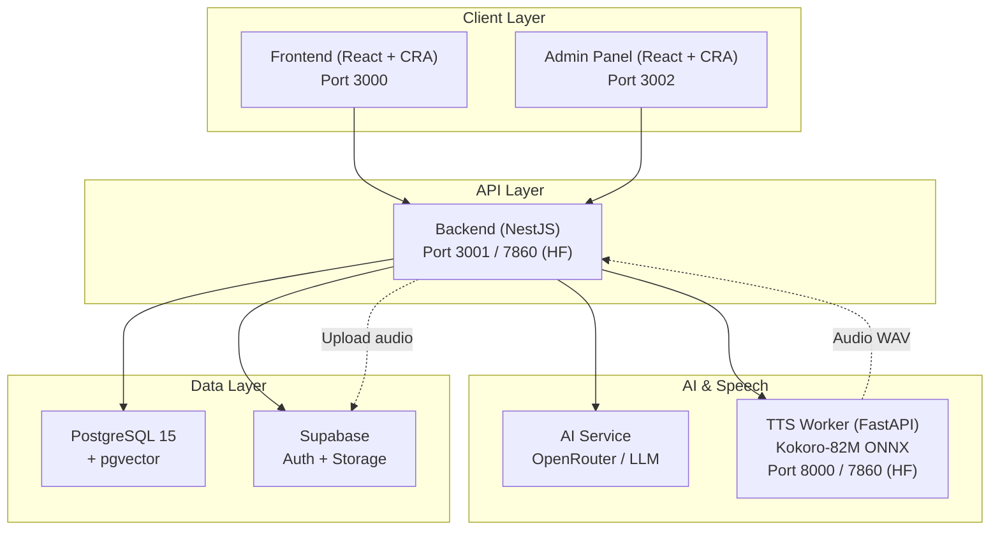
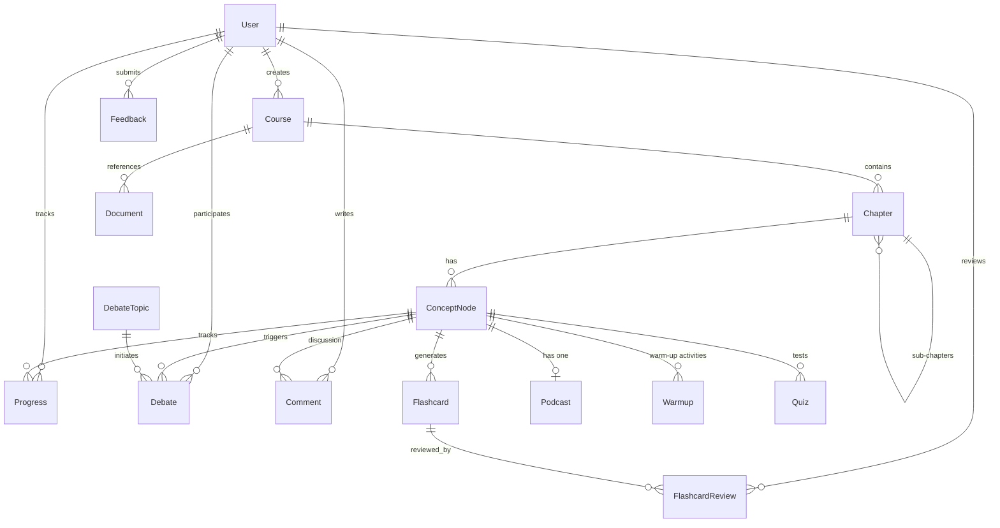
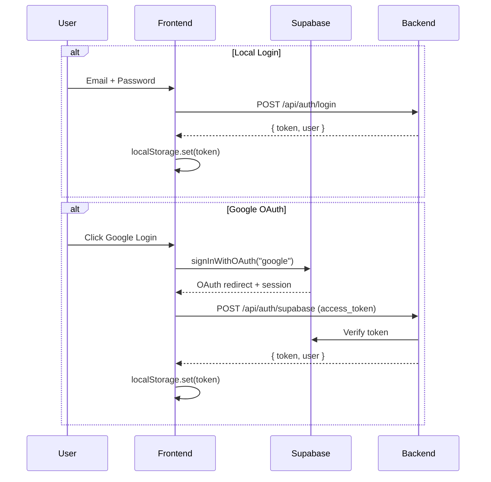
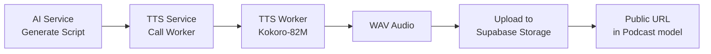

# 🏛️ PhiloMind — Phân Tích Toàn Diện Dự Án

**PhiloMind** là một nền tảng học tập triết học tương tác được hỗ trợ bởi AI, biến sách giáo khoa triết học tuyến tính thành trải nghiệm học tập đa chiều: mindmap, podcast, tranh luận Socratic, flashcard lặp lại cách quãng và quiz đa dạng.

---

## 📐 Kiến Trúc Tổng Quan



Dự án được tổ chức dưới dạng **monorepo** gồm **4 service chính**, containerized bằng Docker Compose:

| Service | Công nghệ | Vai trò | Port |
|---------|-----------|---------|------|
| [frontend](file:///d:/Workspace/Project/PhiloMind/frontend) | React 18 + CRA + TailwindCSS | Giao diện người dùng | 3000 |
| [admin](file:///d:/Workspace/Project/PhiloMind/admin) | React 18 + CRA + TailwindCSS | Bảng quản trị | 3002 |
| [backend](file:///d:/Workspace/Project/PhiloMind/backend) | NestJS 11 + Prisma + TypeScript | REST API server | 3001 |
| [tts_worker](file:///d:/Workspace/Project/PhiloMind/tts_worker) | FastAPI + Kokoro-82M ONNX | Text-to-Speech microservice | 8000 |

---

## 🗄️ Cơ Sở Dữ Liệu (Prisma Schema)

Schema được định nghĩa trong [schema.prisma](file:///d:/Workspace/Project/PhiloMind/backend/prisma/schema.prisma) với **14 model**:



### Các Model Chính:

| Model | Mô tả |
|-------|--------|
| **User** | Người dùng (student/admin), theo dõi streak |
| **Course** | Khóa học, thuộc sở hữu của user |
| **Chapter** | Chương (hỗ trợ cấu trúc cây cha-con) |
| **ConceptNode** | Đơn vị bài học cốt lõi — chứa nội dung, flashcard, podcast, warmup, quiz, lesson framework JSON |
| **Flashcard** | Thẻ ghi nhớ (tag + question + answer) |
| **FlashcardReview** | Review theo thuật toán SM-2 (ease, interval, nextReview) |
| **Podcast** | Audio URL + transcript JSON (speaker/time/text) |
| **Debate / DebateTopic** | Phiên tranh luận Socratic (theo node hoặc topic độc lập) |
| **Quiz** | Đa dạng (mcq, matching, essay, image, analysis) — questions lưu JSON |
| **Warmup** | Hoạt động khởi động (image-guess, story) |
| **Progress** | Tiến trình per-user per-node (lesson, flashcard, podcast, quiz) |
| **Comment** | Thảo luận theo node |
| **Philosofun** | Video giải trí triết học (YouTube) |

> [!IMPORTANT]
> **ConceptNode** là model trung tâm — nó liên kết tới gần như mọi tính năng khác: flashcard, podcast, debate, quiz, warmup, progress, comment, và chứa cả "Lesson Framework" JSON fields (`storyIntro`, `lessonContents`, `minigame`, `finalSummary`, `lessonType`).

---

## ⚙️ Backend (NestJS)

### Module Architecture

Định nghĩa tại [app.module.ts](file:///d:/Workspace/Project/PhiloMind/backend/src/app.module.ts):

| Module | Files | Chức năng |
|--------|-------|-----------|
| **DatabaseModule** | [database/](file:///d:/Workspace/Project/PhiloMind/backend/src/database) | Prisma Client provider |
| **AuthModule** | [auth/](file:///d:/Workspace/Project/PhiloMind/backend/src/auth) | JWT strategy + Guards (JwtAuth, Roles) |
| **AIModule** | [ai/](file:///d:/Workspace/Project/PhiloMind/backend/src/ai) | OpenAI/OpenRouter integration |
| **SupabaseModule** | [supabase/](file:///d:/Workspace/Project/PhiloMind/backend/src/supabase) | Auth sync + Storage bucket |
| **TTSModule** | [tts/](file:///d:/Workspace/Project/PhiloMind/backend/src/tts) | Proxy tới TTS Worker + upload audio |
| **CoursesModule** | [courses/](file:///d:/Workspace/Project/PhiloMind/backend/src/courses) | **Lớn nhất** — CRUD courses, chapters, nodes, podcasts, warmups, documents, comments, progress |
| **DebatesModule** | [debate/](file:///d:/Workspace/Project/PhiloMind/backend/src/debate) | Socratic debate sessions + topics |
| **FlashcardsModule** | [flashcards/](file:///d:/Workspace/Project/PhiloMind/backend/src/flashcards) | SM-2 spaced repetition |
| **QuizzesModule** | [quizzes/](file:///d:/Workspace/Project/PhiloMind/backend/src/quizzes) | Multi-type quizzes |
| **UsersModule** | [users/](file:///d:/Workspace/Project/PhiloMind/backend/src/users) | User CRUD + profile |
| **PhilosofunModule** | [philosofun/](file:///d:/Workspace/Project/PhiloMind/backend/src/philosofun) | Video giải trí CRUD |

### AI Service ([ai.service.ts](file:///d:/Workspace/Project/PhiloMind/backend/src/ai/ai.service.ts))

3 chức năng AI chính:

1. **`getSocraticDebateReply()`** — Tạo phản hồi tranh luận Socratic bằng tiếng Việt, thách thức giả định của người dùng
2. **`extractCourseStructure()`** — Parse nội dung sách giáo khoa thành cấu trúc JSON (chapters → nodes → flashcards)
3. **`generatePodcastScript()`** — Tạo kịch bản đối thoại Host/Guest cho podcast giáo dục

> [!NOTE]
> Tất cả 3 hàm đều có **mock fallback** khi không có API key thực, đảm bảo ứng dụng vẫn demo được offline.

**LLM Configuration:**
- Provider: OpenRouter (`https://openrouter.ai/api/v1`)
- Default model: `meta-llama/llama-3-70b-instruct:free`
- Cấu hình qua env: `OPENAI_API_KEY`, `OPENAI_API_BASE_URL`, `LLM_MODEL`

### API Security ([main.ts](file:///d:/Workspace/Project/PhiloMind/backend/src/main.ts))

- **Helmet** security headers
- **CORS** configurable via `ALLOWED_ORIGINS`
- **JWT Bearer Auth** (global guard trên CoursesController)
- **Role-based access** (`@Roles('admin')`) cho admin operations
- **ValidationPipe** (whitelist + transform + forbidNonWhitelisted)
- **Swagger** docs tại `/docs`
- Global prefix: `/api`

### Endpoints chính (57+ routes)

Tại [courses.controller.ts](file:///d:/Workspace/Project/PhiloMind/backend/src/courses/courses.controller.ts) — controller lớn nhất:

| Category | Endpoints | Auth |
|----------|-----------|------|
| Courses CRUD | `POST/GET/PUT/DELETE /courses` | Admin create/update/delete |
| Journey Roadmap | `GET /courses/:id/journey` | Authenticated |
| Node Details | `GET /courses/nodes/:nodeId` | Authenticated |
| Node Progress | `PATCH/POST /courses/nodes/:nodeId/progress` | Authenticated |
| Chapters CRUD | `POST/GET/PUT/DELETE /chapters` | Admin |
| Nodes CRUD | `POST/GET/PUT/DELETE /nodes` | Admin |
| Podcasts CRUD | `POST/GET/PUT/DELETE /podcasts` | Admin |
| TTS Synthesize | `POST /podcasts/synthesize` | Admin |
| Warmups | `POST/GET/DELETE /nodes/:nodeId/warmups` | Admin |
| Comments | `POST/GET /courses/nodes/:nodeId/comments` | Authenticated |
| Documents | `POST/GET/DELETE /documents` | Admin |
| File Upload | `POST /files/upload` | Admin |

---

## 🎨 Frontend (React)

### Tech Stack
- **React 18** + Create React App (CRA)
- **TailwindCSS 3** cho styling
- **React Router v6** cho routing
- **TanStack React Query** cho data fetching + caching
- **Supabase JS** cho OAuth (Google login)
- **Lucide React** icons

### Routing ([App.js](file:///d:/Workspace/Project/PhiloMind/frontend/src/App.js))

| Route | Component | Mô tả |
|-------|-----------|--------|
| `/` | Home | Trang chủ dashboard |
| `/lessons` | Lesson | Sơ đồ bài học mindmap |
| `/practice` | Practice | Khu luyện tập (flashcard, quiz) |
| `/practice/shinkei/:id` | FlashcardDetail | Trò chơi lật thẻ ghi nhớ (Shinkei-suijaku) |
| `/debate` | DebateCorner | Góc tranh luận Socratic |
| `/philosofun` | Philosofun | Video giải trí triết học |
| `/docs` | Docs | Tài liệu tham khảo |
| `/settings` | Settings | Cài đặt người dùng |
| `/quiz/matching/:id` | MatchingQuiz | Quiz nối câu |
| `/quiz/mcq/:id` | MCQQuiz | Quiz trắc nghiệm |
| `/quiz/analysis/:id` | AnalysisQuiz | Quiz phân tích |
| `/quiz/essay/:id` | EssayQuiz | Quiz luận |
| `/image-quiz/:id` | ImageQuiz | Quiz hình ảnh |

### Components chính

| Component | File | Mô tả |
|-----------|------|--------|
| Navbar | [Navbar.jsx](file:///d:/Workspace/Project/PhiloMind/frontend/src/components/Navbar.jsx) | Navigation bar (14KB - phức tạp) |
| LessonMindmap | [LessonMindmap.jsx](file:///d:/Workspace/Project/PhiloMind/frontend/src/components/LessonMindmap.jsx) | Mindmap canvas tương tác |
| AdventureLessonPlayer | [AdventureLessonPlayer.jsx](file:///d:/Workspace/Project/PhiloMind/frontend/src/pages/lesson/AdventureLessonPlayer.jsx) | Player bài học phiêu lưu (46KB!) |
| ClassicLessonPlayer | [ClassicLessonPlayer.jsx](file:///d:/Workspace/Project/PhiloMind/frontend/src/pages/lesson/ClassicLessonPlayer.jsx) | Player bài học truyền thống |
| AuthContext | [AuthContext.jsx](file:///d:/Workspace/Project/PhiloMind/frontend/src/context/AuthContext.jsx) | Auth state management (Supabase + local) |
| ThemeContext | [ThemeContext.jsx](file:///d:/Workspace/Project/PhiloMind/frontend/src/context/ThemeContext.jsx) | Dark/light mode |

### Data Layer

- **API client**: [api.js](file:///d:/Workspace/Project/PhiloMind/frontend/src/services/api.js) — Fetch wrapper với JWT auth headers
- **Query Keys**: [queryKeys.js](file:///d:/Workspace/Project/PhiloMind/frontend/src/services/queryKeys.js) — TanStack Query key factory
- **Custom Hooks**: `useJourney`, `useLocalStorage`, `useMutations`, `useNodeDetails`
- **Prefetching**: App.js prefetch quizzes, debates topics, documents, philosofun, và due flashcards khi user authenticated

### Authentication Flow



---

## 🔊 TTS Worker (FastAPI + Kokoro-82M)

[main.py](file:///d:/Workspace/Project/PhiloMind/tts_worker/main.py) — Microservice Python chuyên synthesize text → audio WAV:

- **Engine**: [Kokoro-82M ONNX](https://github.com/thewh1teagle/kokoro-onnx) — model TTS nhẹ (82M params)
- **Fallback**: Nếu model không load được → generate synthetic waveform (sine wave modulated)
- **Thread-safe**: Dùng `threading.Lock()` cho concurrent requests
- **Endpoints**:
  - `GET /health` — Health check + model status
  - `POST /api/tts/synthesize` — Text → WAV streaming response
- **Limits**: Max 2000 ký tự per request
- **Default voice**: `af_bella`

### Podcast Pipeline



---

## 🚀 Deployment & CI/CD

### Deployment Architecture

| Service | Platform | URL |
|---------|----------|-----|
| Backend | Hugging Face Docker Space | `Cuong2004/PhiloMind` |
| TTS Worker | Hugging Face Docker Space | `Cuong2004/PhiloMind_TTSworker` |
| Frontend | Vercel | Connected to `/frontend` |

### GitHub Actions Workflows

1. [deploy_backend.yml](file:///d:/Workspace/Project/PhiloMind/.github/workflows/deploy_backend.yml) — Push `backend/` changes → HF Space, monitor build status
2. [deploy_tts.yml](file:///d:/Workspace/Project/PhiloMind/.github/workflows/deploy_tts.yml) — Push `tts_worker/` changes → HF Space

> [!NOTE]
> Không có CI workflow (ci.yml) mặc dù README đề cập. Chỉ có CD workflows.

### Docker Setup ([docker-compose.yml](file:///d:/Workspace/Project/PhiloMind/docker-compose.yml))

4 services: `db` (pgvector:pg15), `tts_worker`, `backend`, `frontend` với health checks và dependency ordering.

---

## 🧩 Admin Panel

Dashboard quản trị riêng biệt tại [admin/](file:///d:/Workspace/Project/PhiloMind/admin) với 10 trang:

| Page | File | Mô tả |
|------|------|--------|
| Dashboard | [Dashboard.jsx](file:///d:/Workspace/Project/PhiloMind/admin/src/pages/Dashboard.jsx) | Tổng quan stats |
| Courses | [Courses.jsx](file:///d:/Workspace/Project/PhiloMind/admin/src/pages/Courses.jsx) | Quản lý khóa học |
| Chapters | [Chapters.jsx](file:///d:/Workspace/Project/PhiloMind/admin/src/pages/Chapters.jsx) | Quản lý chương |
| Nodes | [Nodes.jsx](file:///d:/Workspace/Project/PhiloMind/admin/src/pages/Nodes.jsx) | Quản lý concept nodes (**124KB!** — file lớn nhất) |
| Users | [Users.jsx](file:///d:/Workspace/Project/PhiloMind/admin/src/pages/Users.jsx) | Quản lý người dùng |
| Debates | [Debates.jsx](file:///d:/Workspace/Project/PhiloMind/admin/src/pages/Debates.jsx) | Quản lý tranh luận |
| Practice | [Practice.jsx](file:///d:/Workspace/Project/PhiloMind/admin/src/pages/Practice.jsx) | Quản lý flashcard + quiz (**47KB**) |
| Podcasts | [Podcasts.jsx](file:///d:/Workspace/Project/PhiloMind/admin/src/pages/Podcasts.jsx) | Quản lý podcast + TTS |
| Philosofun | [Philosofun.jsx](file:///d:/Workspace/Project/PhiloMind/admin/src/pages/Philosofun.jsx) | Quản lý video |
| Login | [Login.js](file:///d:/Workspace/Project/PhiloMind/admin/src/pages/Login.js) | Đăng nhập admin |

---

## 📊 Thống Kê Code

### Kích thước file đáng chú ý (Top files)

| File | Size | Ghi chú |
|------|------|---------|
| admin/src/pages/Nodes.jsx | 124 KB | ⚠️ Quá lớn — nên tách |
| backend/prisma/seed.ts | 63 KB | Seed data lớn |
| tts_worker/main.py | 6.7 KB | Gọn gàng |
| frontend/src/pages/Practice.jsx | 43 KB | Phức tạp |
| frontend/src/pages/lesson/AdventureLessonPlayer.jsx | 46 KB | ⚠️ Rất lớn |
| frontend/src/pages/DebateCorner.jsx | 25 KB | |
| backend/src/courses/courses.service.ts | 26 KB | Business logic chính |
| backend/src/ai/ai.service.ts | 14 KB | AI integration |
| lesson_code.md | 123 KB | Documentation/notes lớn |

### Tổng quan dependencies

**Backend** (20 deps): NestJS 11, Prisma 5, OpenAI SDK, Supabase JS, Passport JWT, Helmet, Swagger

**Frontend** (7 runtime deps): React 18, React Router 6, TanStack Query 5, Supabase JS, Lucide Icons

**Admin** (5 deps): React 18, React Router 6, Lucide Icons

**TTS Worker** (6 deps): FastAPI, Uvicorn, Pydantic, NumPy, ONNXRuntime, Kokoro-ONNX

---

## 🔍 Đánh Giá & Nhận Xét

### ✅ Điểm Mạnh

1. **Kiến trúc microservice rõ ràng** — Tách biệt Backend API, TTS Worker, Frontend, Admin
2. **Zero-cost deployment** — Tận dụng Hugging Face Spaces (free) + Vercel (free)
3. **Graceful fallback** — AI Service và TTS Worker đều có mock responses khi không có API key/model
4. **Đa dạng tính năng giáo dục** — Mindmap, podcast, debate, flashcard SM-2, quiz 5 loại, warmup, discussion
5. **CI/CD tự động** — GitHub Actions → Hugging Face Spaces với build monitoring
6. **Security layers** — JWT + Roles guard + Helmet + CORS + Input validation
7. **Data prefetching** — TanStack Query với smart prefetch strategy

### ⚠️ Điểm Cần Cải Thiện

| # | Vấn đề | Mức độ | Khuyến nghị |
|---|--------|--------|-------------|
| 1 | **File quá lớn** — Nodes.jsx (124KB), Practice.jsx (43-47KB), AdventureLessonPlayer.jsx (46KB) | 🔴 Cao | Tách thành sub-components |
| 2 | **Thiếu CI workflow** — Không có linting, formatting check, test automation | 🔴 Cao | Thêm `ci.yml` với ESLint, Prettier, Jest |
| 3 | **DTO inline trong controller** — DTOs định nghĩa trực tiếp trong controller file | 🟡 Trung bình | Tách thành `dto/` folder riêng |
| 4 | **CoursesController quá lớn** (557 lines, 20+ endpoints) | 🟡 Trung bình | Tách thành sub-controllers (chapters, nodes, podcasts, warmups) |
| 5 | **Frontend dùng CRA** — Create React App đã deprecated | 🟡 Trung bình | Migrate sang Vite hoặc Next.js |
| 6 | **Thiếu rate limiting** — Không có throttle cho AI/TTS endpoints | 🟡 Trung bình | Thêm `@nestjs/throttler` |
| 7 | **userId truyền qua body/query** thay vì extract từ JWT token | 🟡 Trung bình | Sử dụng `req.user.id` nhất quán (đã bắt đầu migrate tại controller) |
| 8 | **Admin panel không có Dockerfile** trong docker-compose | 🟢 Thấp | Thêm nếu cần deploy admin |
| 9 | **Thiếu error boundary** ở frontend | 🟢 Thấp | Thêm React Error Boundary |
| 10 | **Node base image inconsistency** — Backend dùng `node:22-alpine`, Frontend dùng `node:18-alpine` | 🟢 Thấp | Thống nhất version |

### 🔒 Security Notes

> [!WARNING]
> - `contentSecurityPolicy: false` trong Helmet config — nên enable với proper directives cho production
> - API key pattern `dummy-key` hardcoded — nên validate riêng
> - Frontend API client truyền `userId` qua query/body — có risk userId spoofing (controller đã bắt đầu dùng `req.user.id` nhưng chưa nhất quán)

---

## 📁 Cấu Trúc Thư Mục Chi Tiết

```
PhiloMind/
├── .github/workflows/
│   ├── deploy_backend.yml          # CD: Backend → HF Space
│   └── deploy_tts.yml              # CD: TTS Worker → HF Space
├── backend/                         # NestJS REST API
│   ├── prisma/
│   │   ├── schema.prisma           # 14 models, PostgreSQL
│   │   └── seed.ts                 # Seed data (63KB)
│   ├── src/
│   │   ├── ai/                     # OpenRouter LLM integration
│   │   ├── auth/                   # JWT + Roles guards
│   │   ├── courses/                # Core CRUD (controller 557 lines)
│   │   ├── database/               # Prisma provider
│   │   ├── debate/                 # Socratic debate service
│   │   ├── flashcards/             # SM-2 spaced repetition
│   │   ├── philosofun/             # Video entertainment CRUD
│   │   ├── quizzes/                # Multi-type quiz service
│   │   ├── supabase/               # Auth sync + Storage
│   │   ├── tts/                    # TTS proxy service
│   │   ├── users/                  # User management
│   │   ├── app.module.ts           # Root module (11 imports)
│   │   └── main.ts                 # Bootstrap + Swagger + Security
│   ├── Dockerfile                   # node:22-alpine → port 7860
│   └── package.json                 # NestJS 11, Prisma 5, OpenAI
├── frontend/                        # React SPA
│   ├── src/
│   │   ├── components/             # 9 shared components
│   │   ├── context/                # AuthContext, ThemeContext
│   │   ├── hooks/                  # 4 custom hooks
│   │   ├── pages/                  # 23 pages + lesson/ sub-dir
│   │   ├── services/               # API client + Query setup
│   │   ├── utils/                  # Supabase client, slug helper
│   │   └── App.js                  # Router (13 routes)
│   ├── Dockerfile                   # node:18-alpine + serve
│   └── package.json                 # React 18, TailwindCSS 3
├── admin/                           # Admin Panel
│   ├── src/
│   │   ├── components/             # AdminPageShell, Toast
│   │   ├── pages/                  # 10 admin pages
│   │   └── services/               # Admin API client
│   └── package.json                 # React 18, TailwindCSS 3
├── tts_worker/                      # Python TTS Microservice
│   ├── main.py                      # FastAPI + Kokoro-82M
│   ├── requirements.txt             # 6 dependencies
│   └── Dockerfile                   # python:3.10-slim + model download
├── data/                            # PDF textbooks + question banks
├── docs/                            # 9 documentation files
├── scripts/                         # Integration test script
├── docker-compose.yml               # 4 services orchestration
├── .env.example                     # Environment template (17 vars)
└── lesson_code.md                   # Lesson framework notes (123KB)
```
